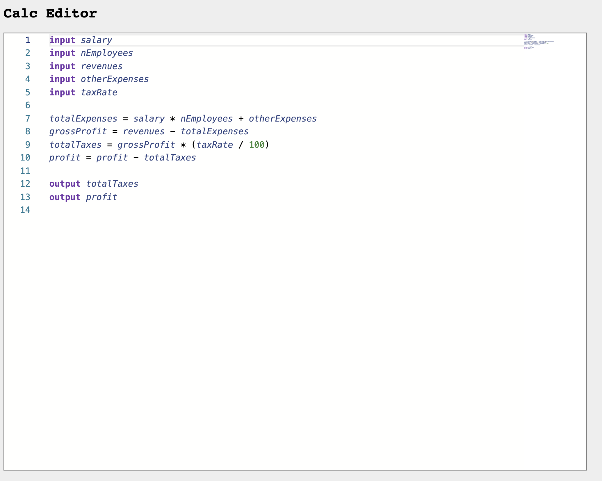

# calc-monaco-editor

This project is explained in the article [Writing a browser based editor using Monaco and ANTLR](https://tomassetti.me/writing-a-browser-based-editor-using-monaco-and-antlr/).

A browser based editor for a simple DSL to perform calculations.

It shows how to integrate ANTLR with monaco.



## Features

* Text editing provided by [monaco](https://github.com/microsoft/monaco-editor)
* Syntax highlighting for custom language
* Syntax error reporting with expected alternatives
* Semantic error reporting for undeclared and redeclared variables

## Generating the lexer and the parser

```
./gradlew generateParser
```

## Build everything and run the server

```
npm install
./gradlew generateParser
tsc
webpack
cd server
../gradlew runServer
```

Now visit http://localhost:8888
